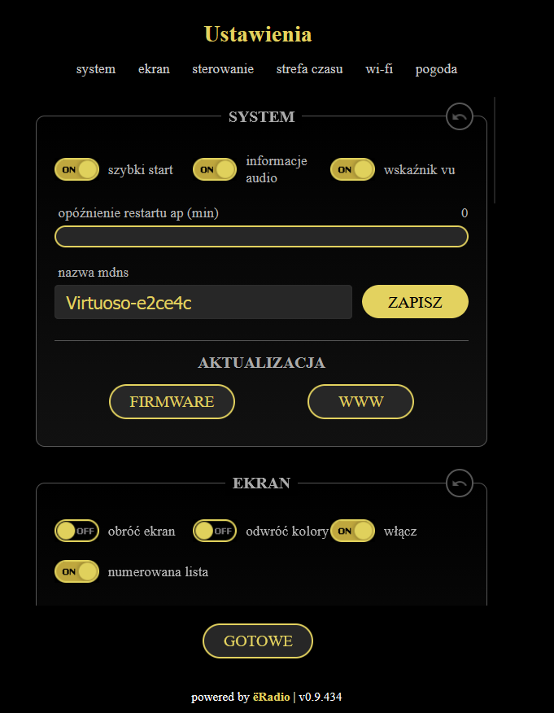
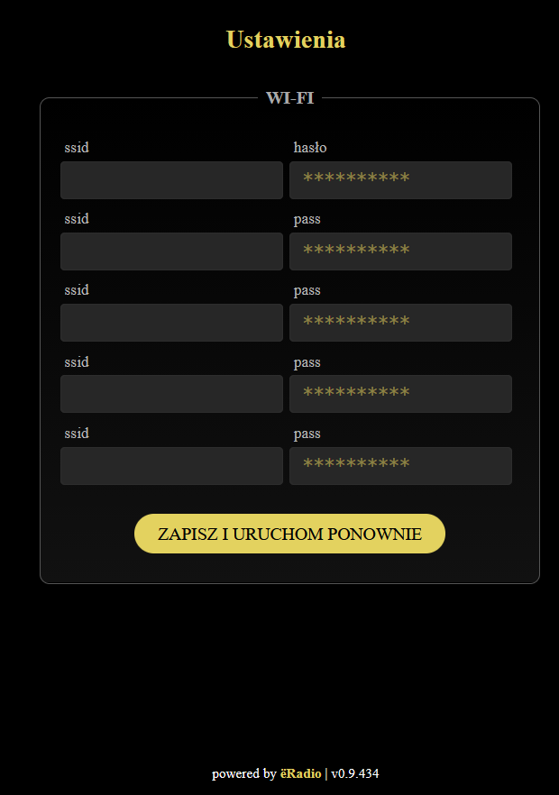
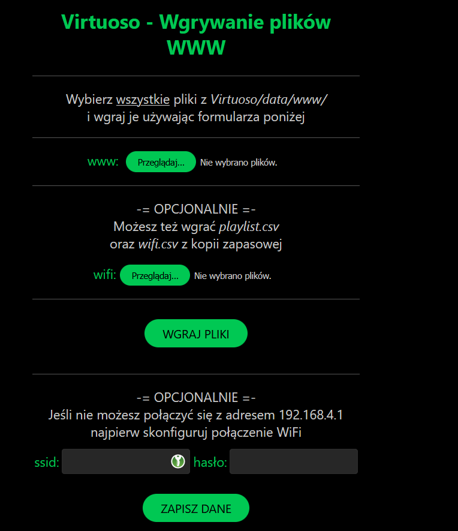
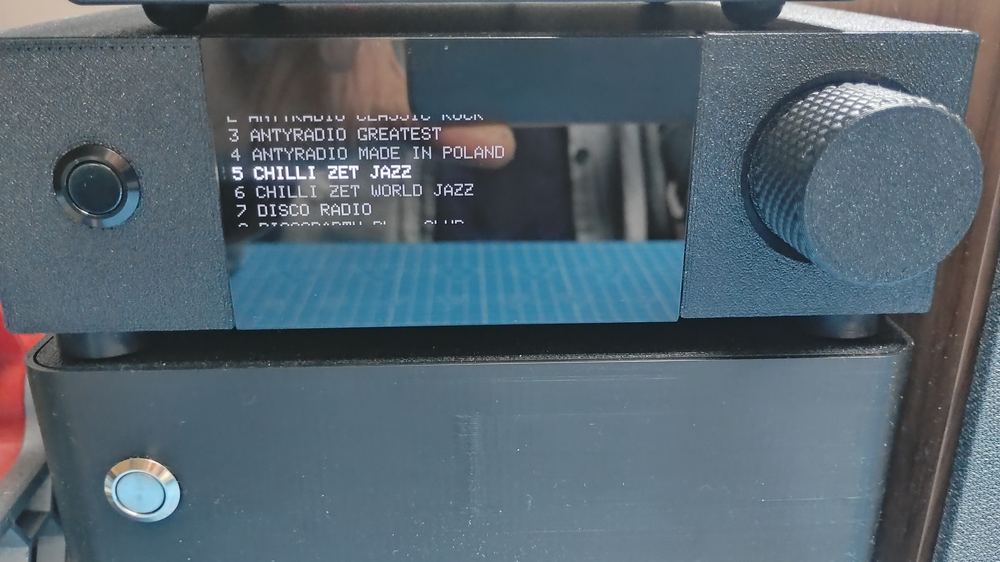

# Virtuoso – autorskie radio internetowe ESP32-S3

Moja własna, zmodyfikowana wersja radia internetowego opartego na projekcie **yoRadio** (fork Maestro).

> **Uwaga.** To wcześniejsza, bazowa wersja projektu. Aktualnie sprzedawane radia Virtuoso mają dodatkowe funkcje (Bluetooth, DLNA, wzmacniacz mocy, aplikacja mobilna), które nie są dostępne w tym repozytorium.

## Co dodałem / zmieniłem

- nowa grafika, ikony i czcionki,
- wygaszacz ekranu z dużą godziną, datą, dniem tygodnia i pogodą (OpenWeatherMap),
- stabilna obsługa polskich stacji radiowych,
- polskie napisy na ekranie i w interfejsie.

## Sprzęt (moja konfiguracja)

Płytka: **ESP32-S3-DevKitC-1** (moduł z PSRAM, np. N16R8).

| Element                | Pin GPIO | Uwagi                               |
|------------------------|----------|-------------------------------------|
| Wyświetlacz SSD1322 DC | 9        | `TFT_DC`                            |
| Wyświetlacz SSD1322 CS | 10       | `TFT_CS`                            |
| Wyświetlacz SSD1322 RST| 8        | `TFT_RST`                           |
| I2S LRC / WS           | 5        | `I2S_LRC`                           |
| I2S DOUT               | 6        | `I2S_DOUT` (do przetwornika DAC)    |
| I2S BCLK               | 7        | `I2S_BCLK`                          |
| I2S MCLK               | 16       | `I2S_MCLK` (dla konwertera SPDIF)   |
| Enkoder CLK (prawo)    | 2        | `ENC_BTNR`                          |
| Enkoder DT (lewo)      | 1        | `ENC_BTNL`                          |
| Enkoder SW (przycisk)  | 42       | `ENC_BTNB`                          |
| Odbiornik IR           | 14       | `IR_PIN`                            |
| Piny 39, 40, 41        | –        | zdefiniowane jako drugi enkoder (`ENC2_*`), w tej wersji nieużywane |

Wszystkie piny możesz zmienić w pliku `Virtuoso/myoptions.h`.

## Jak zbudować i wgrać

### 1. Pobierz projekt

Pobierz repozytorium jako ZIP (**Code → Download ZIP**) i rozpakuj.
Szkic Arduino znajduje się w podfolderze **`Virtuoso`** (to jest folder, który otwierasz w Arduino IDE – plik `Virtuoso/Virtuoso.ino`).

> Nazwa folderu ze szkicem musi być taka sama jak nazwa pliku `.ino`, czyli **`Virtuoso`**. Nie zmieniaj jej i nie wyciągaj plików z tego folderu.

### 2. Zainstaluj narzędzia

1. **Arduino IDE 2.x**.
2. Pakiet płytek **esp32 by Espressif Systems** (Menedżer płytek). Projekt był budowany i sprawdzony z wersją **3.3.11**.
3. Dwie biblioteki z **Menedżera bibliotek** (Narzędzia → Zarządzaj bibliotekami):
   - **Adafruit GFX Library** (dociągnie też *Adafruit BusIO*), sprawdzone z wersją 1.12.6,
   - **arduinoFFT** w wersji **2.x** (sprawdzone z 2.0.4), potrzebna do wskaźnika poziomu.

Pozostałe biblioteki (serwer WWW, MQTT, IR, dekodery audio, OneButton) są dołączone do projektu w folderze `Virtuoso/src`, więc nie instaluj ich osobno. Wersje z Menedżera mogą powodować konflikty.

### 3. Ustaw płytkę (Narzędzia)

| Ustawienie              | Wartość                                                   |
|-------------------------|-----------------------------------------------------------|
| Płytka                  | **ESP32S3 Dev Module**                                    |
| Flash Size              | zgodnie z modułem, np. **16MB (128Mb)** dla N16R8         |
| PSRAM                   | **OPI PSRAM** dla modułów R8 (dla R2: *QSPI PSRAM*)       |
| Partition Scheme        | **8M with spiffs (3MB APP/1.5MB SPIFFS)** lub inny z 3 MB aplikacji i SPIFFS |
| USB CDC On Boot         | **Enabled** jeśli chcesz widzieć logi w monitorze portu przez port USB |

**PSRAM jest wymagany** (dekodery FLAC i m3u8 oraz bufory audio korzystają z niego).

### 4. Wgraj program

Otwórz `Virtuoso/Virtuoso.ino`, kliknij **Weryfikuj**, a potem **Wgraj**.

### 5. Wgraj pliki interfejsu WWW

Przy pierwszym uruchomieniu radio nie ma jeszcze plików strony WWW, więc samo tworzy sieć Wi-Fi:

1. Połącz telefon lub komputer z siecią **`Virtuoso`** (hasło domyślne: `12345987`; nazwa i hasło są też widoczne na ekranie radia).
2. Otwórz w przeglądarce **`http://192.168.4.1`**. Pojawi się strona „Wgrywanie plików WWW".
3. Wybierz **wszystkie** pliki z folderu `Virtuoso/data/www/` i kliknij **Wgraj pliki**. Opcjonalnie możesz wgrać też własny `playlist.csv`.
4. Podaj dane swojej sieci Wi-Fi (jeśli strona o to prosi), a radio uruchomi się ponownie i będzie dostępne pod adresem IP widocznym na ekranie.

### 6. Polskie znaki na ekranie

Aby polskie litery wyświetlały się poprawnie, trzeba podmienić czcionkę w bibliotece Adafruit GFX:

1. Zainstaluj Adafruit GFX Library (krok 2).
2. Uruchom skrypt `Virtuoso/Update_Polish_Font.ps1` (prawy klik → *Uruchom za pomocą PowerShell*). Skopiuje plik `PL/glcdfont.c` do folderu biblioteki.
3. Pozostałe pliki z folderu `PL` (`displayL10n_custom.h`, `utf8RusGFX.h`) są już na swoich miejscach w projekcie.
4. Zrestartuj Arduino IDE i skompiluj ponownie.

Ręcznie: skopiuj `Virtuoso/PL/glcdfont.c` do `Dokumenty\Arduino\libraries\Adafruit_GFX_Library\` i zastąp istniejący plik.

## Najczęstsze problemy

| Komunikat | Przyczyna i rozwiązanie |
|---|---|
| `core/options.h: No such file or directory` | Otwarty zły folder lub zmieniona struktura. Otwórz plik `Virtuoso/Virtuoso.ino`; kod źródłowy ma być w `Virtuoso/src` (w tym `src/main.cpp`). Nie zmieniaj nazw folderów. |
| `Adafruit_GFX.h: No such file or directory` | Zainstaluj bibliotekę *Adafruit GFX Library* z Menedżera bibliotek. |
| `arduinoFFT.h: No such file or directory` | Zainstaluj bibliotekę *arduinoFFT* (wersja 2.x) z Menedżera bibliotek. |
| Brak dźwięku z FLAC lub restart przy FLAC | Wybierz ustawienia płytki z PSRAM (patrz tabela wyżej). FLAC działa tylko z PSRAM. |
| Brak logów w monitorze portu | Ustaw **USB CDC On Boot: Enabled** albo użyj portu UART płytki. |

## Licencja

Projekt bazuje na [yoRadio](https://github.com/e2002/yoradio) – licencja **GNU GPL v3.0**.
Moje modyfikacje (grafika, wygaszacz z pogodą, obsługa SPDIF, pojedynczy enkoder itp.) również udostępniam na licencji GPL-3.0.
Pełny tekst licencji: <https://www.gnu.org/licenses/gpl-3.0.txt>

## Zrzuty ekranu

| Ustawienia radia | Ustawienia Wi-Fi | Lista stacji |
|---|---|---|
|  |  |  |

